# Common Room MCP Server

> ⚠️ **Note:** This is an unofficial MCP server for Common Room

Here's a self-hosted MCP for integrating the Common Room API with Amazon Q CLI and Claude Code. The goal is to be able to ask questions and make updates easily for your own instance. Hope this makes it easier to keep your activities, segments, and organizations up to date! 🥳

[](https://opensource.org/licenses/MIT)

## How It Works

This MCP server exposes Common Room API functionality as tools that Q CLI can use:

1. **MCP Protocol**: Server communicates with Q CLI via Model Context Protocol
2. **Tool Registration**: Each Common Room API endpoint becomes a callable tool
3. **Authentication**: Uses your Common Room API key from environment variables
4. **JSON Responses**: All data returned as formatted JSON for easy reading

## Common Room MCP Architecture

```mermaid
%%{init: {'flowchart': {'curve': 'basis'}}}%%
graph LR
    A["💻<br/>Q CLI"] -.-> B["🔌<br/>MCP Server"]
    C["💻<br/>Claude Code"] -.-> B
    B <--> D["☁️<br/>Common Room API"]
    
    style A fill:#6366f1,stroke:#000,stroke-width:3px,color:#fff
    style C fill:#ff9900,stroke:#000,stroke-width:3px,color:#000
    style B fill:#C11C84,stroke:#000,stroke-width:3px,color:#fff
    style D fill:#10b981,stroke:#000,stroke-width:3px,color:#000
```



When you ask Q CLI or Claude Code to "get Common Room activity types", it:
1. Calls the `commonroom_get_activity_types` tool
2. Server makes API request to Common Room
3. Returns formatted results to Q CLI
4. The agent presents the data to you in context

## Quick Setup

1. **Clone/download this repository**
2. **Install dependencies**: `pip install -r requirements.txt`
3. **Configure environment**: Copy `.env.example` to `.env` and add your API key
4. **Configure MCP client** (see [INSTALL.md](INSTALL.md) for detailed instructions)

### Claude Code
Add to `~/Library/Application Support/Claude/claude_desktop_config.json`:
```json
{
  "mcpServers": {
    "commonroom": {
      "command": "python",
      "args": ["/path/to/commonroom-mcp/server.py"],
      "env": {"COMMONROOM_KEY": "${COMMONROOM_KEY}"}
    }
  }
}
```

### Amazon Q CLI
```bash
q chat --mcp-config ~/.config/amazon-q/mcp-config.json
```

**📖 [Complete Installation Guide](INSTALL.md)**

## Setup

1. **Install dependencies**:
   ```bash
   cd /path/to/commonroom-mcp
   pip install -r requirements.txt
   ```

2. **Configure environment**:
   ```bash
   cp .env.example .env
   # Edit .env file with your API credentials:
   # COMMONROOM_KEY=your_api_token_here
   # COMMONROOM_BASE_URL=https://app.commonroom.io/community/your-community-id
   ```

3. **Test server**:
   ```bash
   python server.py
   ```

## Available Tools

- `commonroom_get_activity_types` - List all activity types
- `commonroom_get_segments` - List all segments  
- `commonroom_get_tags` - List all tags
- `commonroom_get_user` - Get user by email (includes dashboard_url)
- `commonroom_add_activity` - Add activity
- `commonroom_add_user` - Add user
- `commonroom_get_dashboard_urls` - Get dashboard section URLs
- `commonroom_get_member_url` - Get individual member page URL
- `commonroom_get_organization_url` - Get individual organization page URL
- `commonroom_get_segment_url` - Get individual segment page URL

## Usage in Q CLI

Once configured, you can use Common Room tools in Q CLI:

```
Get all Common Room activity types
Get segments for my team
Add a new blog post activity to Common Room
Show me the URL for user ID 12345
```

## Example Queries

**Get activity types:**
```
Show me all Common Room activity types
```

**Find user:**
```
Get Common Room user data for trag@example.com
```

**Get member URL:**
```
What's the URL for Common Room member 226882839?
```

**Add activity:**
```
Add a blog post activity to Common Room with title "Fire TV Guide" by chris@example.com
```

**📋 [Click here for more examples prompts >> ](EXAMPLES.md)**

## Tool Details

- `commonroom_get_activity_types` - Returns all available activity types (article, webinar, etc.)
- `commonroom_get_segments` - Returns audience segments in your Common Room
- `commonroom_get_tags` - Returns all tags for categorization
- `commonroom_get_user` - Finds user by email address (includes dashboard_url)
- `commonroom_add_activity` - Creates new activity record
- `commonroom_add_user` - Creates new user record
- `commonroom_get_dashboard_urls` - Returns URLs for all dashboard sections (requires COMMONROOM_BASE_URL)
- `commonroom_get_member_url` - Returns URL for individual member page
- `commonroom_get_organization_url` - Returns URL for individual organization page
- `commonroom_get_segment_url` - Returns URL for individual segment page

## Documentation

- **[INSTALL.md](INSTALL.md)** - Complete installation guide for Claude Code and Amazon Q CLI
- **[EXAMPLES.md](EXAMPLES.md)** - Sample prompts and queries to test the MCP server
- **[SPEC.md](SPEC.md)** - Technical specification and requirements
- **[openapi.json](openapi.json)** - Common Room API specification

## Keeping Up to Date

The server automatically checks for changes to Common Room's OpenAPI spec updates 30 seconds after startup and logs any available updates.

**Manual update:**
```bash
./update_spec.sh
```

**Check for updates:**
```bash
python version_checker.py
```

## Security

- Never commit your `.env` file or API keys
- Use environment variables for sensitive data
- Keep your Common Room API token secure
- This server runs locally and doesn't send data to third parties

## Support

**Looking for support?** Check out the [Common Room docs](https://docs.commonroom.io/) or join the [Uncommon community](https://www.commonroom.io/uncommon) for product help.

For Common Room platform support, visit: https://www.commonroom.io/contact/

*This MCP server is not officially supported by Common Room.*

---

## Contributing

See [CONTRIBUTING.md](CONTRIBUTING.md) for development guidelines.
